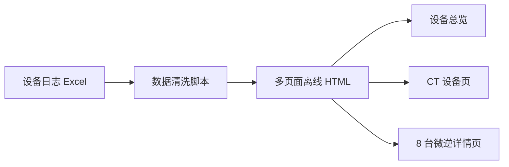
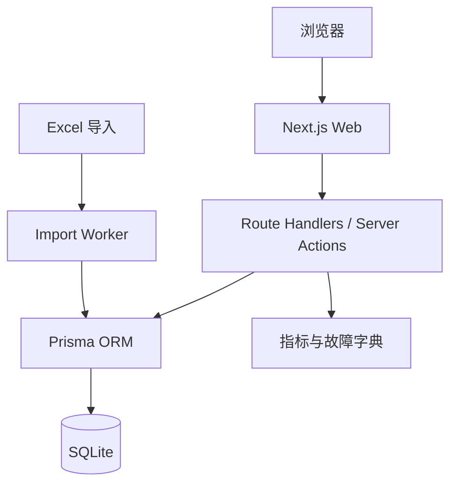
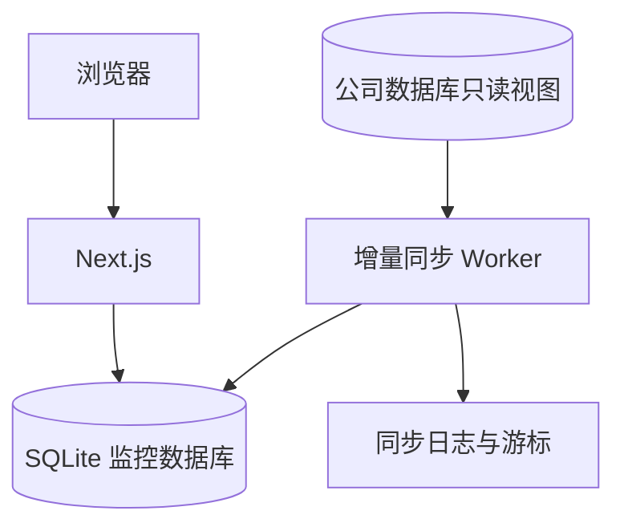
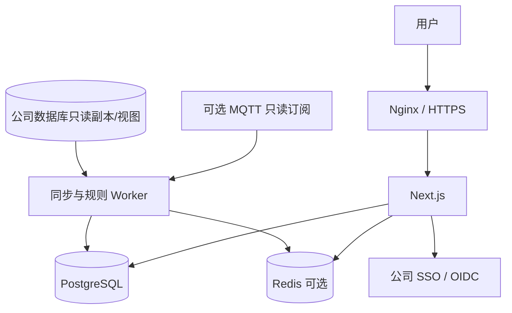

# 系统架构设计

## 1. 当前原型架构



当前原型用于验证页面、字段归类和交互，不支持动态数据库查询。

## 2. 一期目标架构



一期特点：

- 单项目部署；
- SQLite；
- Excel 导入；
- 多设备 SN 查询；
- 最近 7 天数据；
- 不连接生产控制通道；
- 可导出离线 HTML 快照。

## 3. 二期目标架构



二期重点：

- 公司数据库只读接入；
- 增量同步；
- 按 SN、SIID、PIID 标准化；
- 仍可使用 SQLite 验证完整数据链路；
- 生产数据库故障时保留已同步数据。

## 4. 三期生产架构



## 5. 模块划分

```text
app/
├── overview/                 设备总览
├── devices/[sn]/             CT 设备详情
├── devices/[sn]/inverters/   微逆详情
├── alarms/                   告警中心
└── api/                      服务端 API

src/
├── domain/                   领域模型与状态规则
├── repositories/             数据访问
├── services/                 查询、同步、告警、统计
├── adapters/
│   ├── excel/                Excel 导入
│   ├── source-db/            公司数据库
│   └── mqtt/                 后续只读 MQTT
├── metrics/                  指标字典
├── faults/                   故障位解码
└── export/                   HTML 快照导出
```

## 6. 数据流

### 6.1 历史数据

```text
公司数据库或 Excel
→ 数据适配
→ 校验和标准化
→ telemetry
→ 聚合查询
→ 图表
```

### 6.2 最新状态

```text
最新上报
→ device_latest
→ 设备总览
→ CT/微逆卡片
```

### 6.3 状态事件

```text
online_state / 平台上下线事件
→ 状态变化检测
→ device_events
→ 持续时长计算
```

### 6.4 故障事件

```text
fault_param
→ 与上一个值比较
→ 位掩码解码
→ fault_events
→ 故障出现/变化/恢复
```

## 7. 技术选型

### 前端与服务端

- Next.js；
- TypeScript；
- Apache ECharts；
- TanStack Query 可选；
- Zod 用于运行时数据校验。

### 数据层

- Prisma ORM；
- SQLite 起步；
- PostgreSQL 生产；
- 数据库迁移由 Prisma Migration 管理。

### 测试

- Vitest；
- React Testing Library；
- Playwright；
- 数据库集成测试；
- 导入和同步幂等测试。

## 8. 为什么先 SQLite 再 PostgreSQL

SQLite 适合：

- 快速开发；
- 单机原型；
- Excel 数据导入；
- 少量内部用户；
- 验证表结构和查询。

迁移 PostgreSQL 的触发条件：

- 多人并发；
- 数百或数千设备；
- 持续同步写入；
- 多实例部署；
- 稳定告警；
- 备份和恢复；
- 数据量达到数百万级并持续增长。
