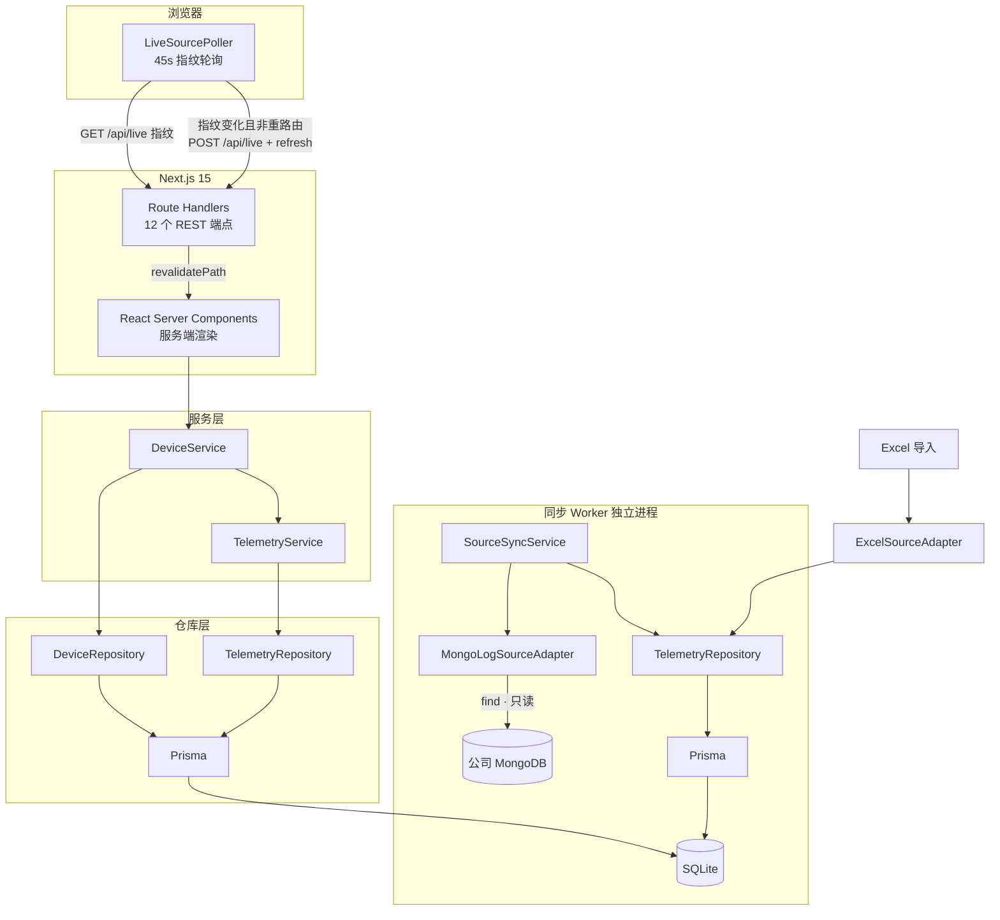
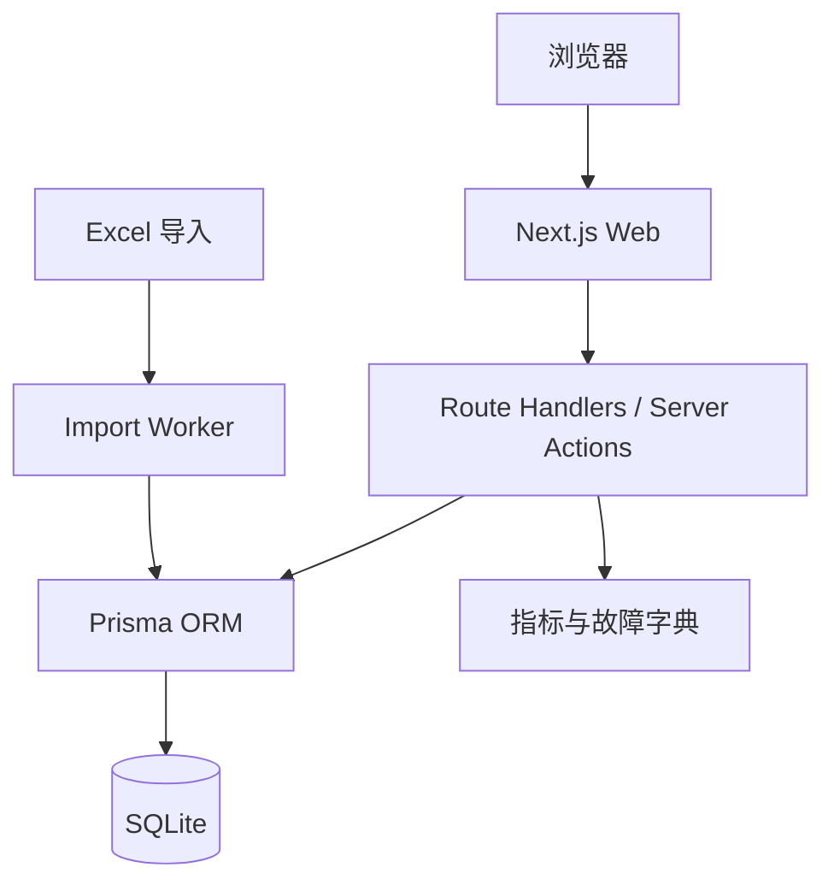
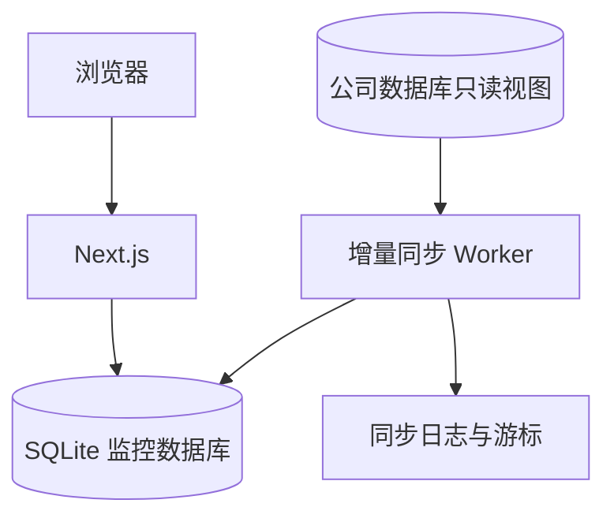
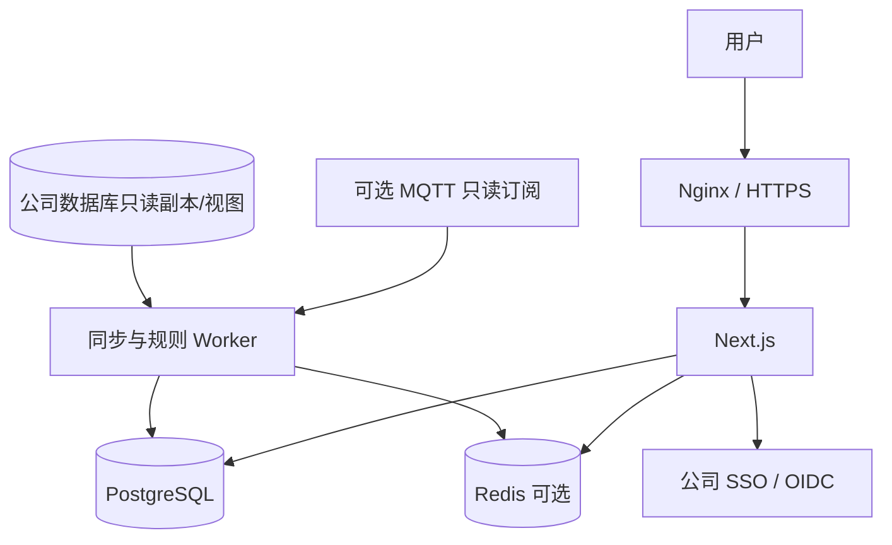

# 系统架构设计

## 1. 当前实现架构



### 当前实际特点

- 单项目部署，SQLite 单文件数据库；
- 同步 Worker 是独立 OS 进程，通过 SQLite 文件与 Web 进程通信；
- 100% 服务端数据获取，浏览器不做任何遥测 API 调用；
- 6 个 Client Component（LiveSourcePoller、SoftRefreshButton、TelemetryChart、MetricHistoryDialog、DeviceSnSwitcher、DeviceSnSearch）；
- 软刷新：约 45s 轮询 `/api/live` 指纹；总览指纹变化才 `POST` + `router.refresh()`；详情/微逆先 `notify-stale`（横幅 + 启动 5min 计时，`lastHeavyFullRefreshMs=0` 不立刻整页刷），满 5min 且无 pending 才整页刷；手动按钮与 Poller 共享 `refreshInFlight` 锁；KPI 另约 60s 拉 `/latest`（`soft-refresh-policy.ts` / `device-live-kpis.tsx`）；
- 不连接生产控制通道，不修改设备参数；
- 可导出离线 HTML 快照（自包含，零网络）。

## 2. 一期目标架构



一期特点：

- 单项目部署；
- SQLite；
- Excel 导入；
- 多设备 SN 查询；
- 最近 7 天数据；
- 不连接生产控制通道；
- 可导出离线 HTML 快照。

## 3. 二期目标架构



二期重点：

- 公司数据库只读接入；
- 增量同步；
- 按 SN、SIID、PIID 标准化；
- 仍可使用 SQLite 验证完整数据链路；
- 生产数据库故障时保留已同步数据。

## 4. 三期生产架构



## 5. 实际模块划分

```text
app/
├── page.tsx                    → redirect /devices
├── layout.tsx                  LiveSourcePoller 全局挂载
├── devices/
│   ├── layout.tsx              dynamic='force-dynamic' + revalidate=0
│   ├── page.tsx                设备总览（列表 + 筛选 + 统计）
│   └── [sn]/
│       ├── page.tsx            CT 设备详情（面板 + 图表 + 微逆网格）
│       └── inverters/[index]/
│           └── page.tsx        微逆详情（发电 + 图表 + 故障）
└── api/
    ├── devices/                 设备列表 + 详情 + 遥测 + 历史 + 告警 + 健康
    ├── live/                    同步状态指纹 + 缓存刷新
    └── imports/excel/           Excel 导入

src/
├── domain/                    领域模型与状态规则
│   ├── monitoring.ts           逆流判定、状态标签、图表系列定义、间隙处理
│   ├── sustained-reverse-flow.ts 近7天长时逆流(≥40min)判定
│   ├── soft-refresh-policy.ts  自动 soft-refresh 决策（重路由/指纹/5min 门禁/不叠刷）
│   ├── live-kpis.ts            详情 KPI 快照派生（服务端可调用）
│   ├── beijing-sun.ts          北京日出日落计算（NOAA 近似）
│   ├── faults.ts               故障位掩码解码
│   ├── dictionaries.ts          字典加载（状态、故障）
│   ├── device-identity.ts      设备 SN 标识策略
│   ├── online-inverter-count.ts 在线微逆计数标准化
│   └── validation.ts            Zod Schema 集中管理
├── repositories/               数据访问
│   ├── device-repository.ts    设备 + 绑定 + 最新数据
│   └── telemetry-repository.ts 时序写入 + 去重 + 最新值维护
├── services/                   查询、同步、分析
│   ├── device-service.ts       设备组合查询 + 逆流告警 + 图表数据
│   ├── telemetry-service.ts    连通性分析 + 故障时间线 + 时序统计
│   ├── source-sync-service.ts  Mongo 增量同步编排
│   └── source-sync-worker.ts   Worker 调度循环
├── adapters/
│   ├── source/                 Excel 数据源
│   └── source-db/              Mongo 只读数据源 + 设备注册表
├── components/                 6 个 Client Component + 纯渲染组件
│   ├── telemetry-chart.tsx     ECharts 图表（458 行，核心组件）
│   ├── live-source-poller.tsx  45s 指纹轮询 + 条件 soft-refresh
│   ├── live-data-stale-context.tsx  有新数据横幅状态 + 共享刷新锁
│   ├── device-live-kpis.tsx    详情 KPI 约 60s 局部轮询
│   ├── data-stale-banner.tsx   「有新数据」提示条
│   ├── metric-history-dialog.tsx 弹窗图表
│   └── ...                     其他组件
└── export/offline/             离线 HTML 导出
    ├── build-*-view-model.ts   视图模型构建
    ├── render-html.ts          HTML 渲染
    ├── client-runtime.ts       浏览器端 ECharts 运行时
    ├── echarts-asset.ts        ECharts 内联加载
    ├── embedded-view-model.ts  视图模型提取与回环
    ├── package-export.ts       单文件 + Bundle + ZIP 导出
    ├── zip-archive.ts          手写 ZIP 打包器
    └── cli.ts                  CLI 参数解析
```

## 6. 数据流

### 6.1 历史数据

```text
公司数据库或 Excel
→ 数据适配
→ 校验和标准化
→ telemetry
→ 聚合查询
→ 图表
```

### 6.2 最新状态

```text
最新上报
→ device_latest
→ 设备总览
→ CT/微逆卡片
```

### 6.3 状态事件

```text
online_state / 平台上下线事件
→ 状态变化检测
→ device_events
→ 持续时长计算
```

### 6.4 故障事件

```text
fault_param
→ 与上一个值比较
→ 位掩码解码
→ fault_events
→ 故障出现/变化/恢复
```

## 7. 技术选型

### 前端与服务端

- Next.js；
- TypeScript；
- Apache ECharts；
- TanStack Query 可选；
- Zod 用于运行时数据校验。

### 数据层

- Prisma ORM；
- SQLite 起步；
- PostgreSQL 生产；
- 数据库迁移由 Prisma Migration 管理。

### 测试

- Vitest；
- React Testing Library；
- Playwright；
- 数据库集成测试；
- 导入和同步幂等测试。

## 8. 为什么先 SQLite 再 PostgreSQL

SQLite 适合：

- 快速开发；
- 单机原型；
- Excel 数据导入；
- 少量内部用户；
- 验证表结构和查询。

迁移 PostgreSQL 的触发条件：

- 多人并发；
- 数百或数千设备；
- 持续同步写入；
- 多实例部署；
- 稳定告警；
- 备份和恢复；
- 数据量达到数百万级并持续增长。
