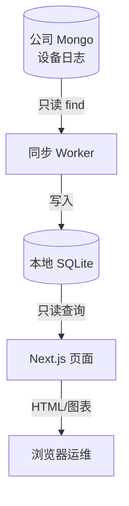
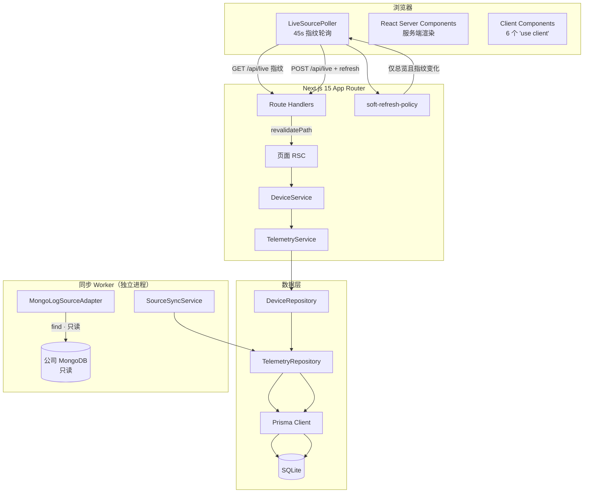
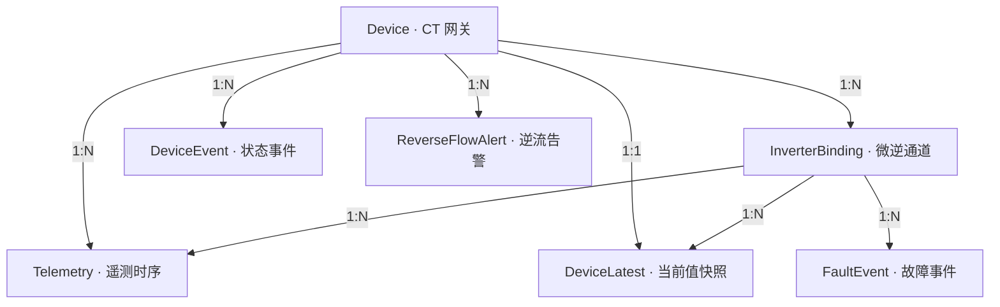

# 技术路线总览 — 防逆流设备运行可视化系统

> 读者：嵌入式软件工程师（对 MCU/RTOS/寄存器熟悉，对 Web/Node 可能陌生）。  
> 目标：看懂本系统「每一层干什么、用了什么术语、和嵌入式世界怎么对应」，再对照代码细节。  
> 证据：以当前仓库代码为准；实现声明标 ✅ 代码路径 / ⚠️ 待环境验证。

日常怎么启动、卡死怎么恢复 → [11_OPS_RUNBOOK.md](../11_OPS_RUNBOOK.md)。

---

## 0. 给嵌入式工程师的术语速查

把本项目想成：**一块「只观察、不下发」的上位机仪表盘**。设备端仍是你们熟悉的 CT/微逆固件；本仓库是电脑上的 **只读监视器**。


| Web/本仓库术语                       | 一句话                              | 嵌入式类比                           |
| ------------------------------- | -------------------------------- | ------------------------------- |
| **Node.js**                     | 在电脑上跑 JavaScript/TypeScript 的运行时 | 像一台「PC 上的裸机/RTOS 环境」，不是浏览器插件    |
| **Next.js**                     | 基于 React 的 Web 框架，负责页面与少量 API    | 上位机 UI 框架（界面 + 少量本地服务）          |
| **RSC（React Server Component）** | 页面主要在服务器拼好 HTML 再发给浏览器           | 服务端先算完再显示，类似上位机先查库再刷新窗体         |
| **Client Component**            | 必须在浏览器跑的交互件（图表、定时器）              | 上位机里必须本地跑的控件（绘图控件、定时器）          |
| **TypeScript**                  | 带类型的 JS                          | 接近「带类型检查的 C」，编译期抓错              |
| **Prisma / ORM**                | 用代码对象读写数据库，少写手拼 SQL              | 类似「结构化访问 Flash/EEPROM 的封装层」     |
| **SQLite**                      | 单文件关系型数据库                        | 一个本地 `.db` 文件 ≈ 上位机本地存储         |
| **MongoDB**                     | 公司侧文档库；本系统只 **find 只读**          | 公司云端日志库；你们只订阅/拉取，不写回            |
| **Worker / 同步进程**               | 独立 OS 进程，定时从 Mongo 拉数据写入 SQLite  | 独立任务：后台采集线程，与 UI 进程分离           |
| **Checkpoint / 游标**             | 记住「同步到哪」                         | 类似 Flash 里存的 last-sync 指针，断电可续传 |
| **Telemetry（遥测）**               | 带时间戳的指标采样点                       | 属性上报历史：功率、电压、online_state…      |
| **metricKey**                   | 指标名字字符串                          | 类似「属性 ID / 信号名」的可读键             |
| **siid / piid**                 | 物模型服务/属性编号                       | 固件物模型里的 SIID/PIID               |
| **Repository / Service**        | 数据访问层 / 业务编排层                    | Driver 读寄存器 vs 应用层策略            |
| **幂等（idempotent）**              | 同一条数据写多次结果不变                     | 重复帧丢弃，不覆盖已有正确记录                 |
| **软刷新 soft-refresh**            | 不整页跳转，只让服务器重算当前页                 | 上位机「刷新当前窗」而非关掉重开                |
| **指纹 fingerprint**              | 用几个字段拼成的「数据版本号」                  | 类似心跳序列号：变了才刷新                   |
| **Docker Compose**              | 用容器把 Web + Worker 打包跑            | 把整套上位机装进隔离环境一键起                 |
| **REST API**                    | HTTP 路径上的查询接口                    | 上位机对外提供的只读命令字（本项目页面主要不靠它拿曲线）    |
| **Zod**                         | 运行时校验入参形状                        | 对外部输入做 schema 检查，防脏数据           |
| **ECharts**                     | 浏览器里画曲线的库                        | 示波器/上位机曲线控件                     |





**边界（务必记住）：** 本系统 **不下发 MQTT/OTA/配对/改参**；只观察已同步到本地的数据。

---


## 1. 系统全景


### 本节功能介绍

回答三个问题：系统用什么技术搭的？数据从哪来、页面怎么刷新？为什么详情页不能盲目自动刷新？

对嵌入式同学：把整机分成 **采集任务（Worker）** 和 **显示任务（Next）**，中间用 **SQLite 文件** 当共享内存/邮箱，避免 UI 直接打公司库。

### 1.1 技术栈

**功能介绍：** 列出「运行环境 + 框架 + 库」——相当于 BOM 里的主控、RTOS、协议栈、绘图库。


| 层      | 技术                    | 版本         | 角色               | 小白注释        |
| ------ | --------------------- | ---------- | ---------------- | ----------- |
| 运行时    | Node.js 22            | LTS        | 单体服务 + 同步 Worker | 电脑上跑 TS 的引擎 |
| Web 框架 | Next.js 15 App Router | 15.1       | RSC 为主、少量 Client | 页面框架        |
| 语言     | TypeScript            | 5.6        | 全栈               | 有类型的 JS     |
| ORM    | Prisma                | 5.20       | SQLite 访问        | 对象化读写库      |
| 数据库    | SQLite                | —          | 单文件本地库           | 一个 `.db` 文件 |
| 图表     | Apache ECharts        | 6.1        | 浏览器画曲线           | 示波控件        |
| 验证     | Zod                   | 3.24       | 入参 Schema        | 输入合法性检查     |
| 电子表格   | xlsx                  | 0.18       | Excel 导入/导出      | 离线数据源       |
| 源数据库   | MongoDB               | 7.5        | 只读拉公司日志          | 云端源         |
| 测试     | Vitest + Playwright   | 4.1 / 1.61 | 单元/集成/E2E        | 自动化回归       |
| 容器     | Docker Compose        | —          | Web + Sync       | 正式打包        |


### 1.2 为什么先 SQLite 再 PostgreSQL

**功能介绍：** 解释「本地单文件库」为何够用，以及什么时候才要换「真正的服务器数据库」。

SQLite 适合当前阶段：快速开发、单机原型、Excel 导入、少量内部用户。迁移 PostgreSQL 的触发条件是：多人并发、数百/数千设备、持续同步写入、多实例部署、稳定告警。Prisma 抽象了数据库差异，迁移主要改 `datasource` 配置。

嵌入式类比：先用片上 Flash 存日志；量产多客户端并发时再上外置大容量数据库服务器。

### 1.3 渲染架构

**功能介绍：** 说明浏览器、Next 服务、SQLite、Mongo Worker 如何协作；谁负责「采数」、谁负责「展示」。




**术语：**

- **服务端渲染（RSC）**：曲线数据在服务器查好再出 HTML，浏览器主要负责画图与少量交互。
- **Route Handler**：`/api/...` 这种 HTTP 接口；本项目里指纹探测用它。
- **DeviceService / TelemetryService**：业务编排（组合查询、逆流、连通性）。

**关键设计决策：**

- **页面遥测以 RSC 直查为主**：不是浏览器每秒狂拉曲线 API；唯一轻量轮询是 `GET /api/live` 指纹。
- **少量 Client Component**：`LiveSourcePoller`、`SoftRefreshButton`、`TelemetryChart` 等。
- **软刷新有门禁**：`decideSoftRefresh`——总览指纹变化才 refresh；详情指纹变先 `notify-stale`，满 5 分钟才整页刷；pending 时绝不叠刷。
- **同步 Worker 是独立 OS 进程**：`npm run source:worker` 写 SQLite；Web 进程主要只读。

### 1.4 软刷新策略（防 Next 假死）

**功能介绍：** 防止「定时刷新」把服务器刷死，同时保留「有数据更新」的体验。

| 页面 | 自动行为 |
|------|----------|
| 总览 | 指纹变化 → soft-refresh（轻量列表） |
| 详情 / 微逆 | 指纹变化 →「有新数据」横幅；KPI 约 60s 局部拉 `latest`；**≥5min** 且无 pending 才整页刷一次 |
| 曲线 / 7 天历史 | 点「刷新数据」立刻；或等上面的 5min 门禁 |

设备详情一次 RSC 极重（历史 + 8 路摘要 + 8 路 7 天曲线）。旧逻辑约每 45s **无条件** refresh，并在 pending 超时后再叠刷，曾导致 Next 高 CPU / `CLOSE_WAIT` / 全站超时。

| 参数 / 规则 | 值 | 说明 |
|---|---|---|
| 指纹轮询 | 45 秒 | 仅探测，不等于每次都整页 refresh |
| 冷却 | 30 秒 | `cooldownMs` |
| 指纹 GET 超时 | 4 秒 | 失败则跳过，不盲刷 |
| 重路由整页门禁 | ≥5 分钟 | `DEFAULT_HEAVY_FULL_REFRESH_MIN_MS` |
| KPI 局部 | ~60 秒 | `device-live-kpis.tsx` → `/latest` |
| pending | 进行中 | skip；stale 只清客户端锁，不叠刷 |

新鲜度：Worker≈10s 起一轮；KPI 体感约 1～2 分钟；**不是秒级实时**。

运维侧应急与启动流程见 [11_OPS_RUNBOOK.md](../11_OPS_RUNBOOK.md)。

---


## 2. 数据模型


### 本节功能介绍

回答：本地 SQLite 里有哪些表？谁存「当前值」、谁存「历史曲线」？哪些表是死的？

嵌入式类比：


| 表角色                          | 类比              |
| ---------------------------- | --------------- |
| `Device` / `InverterBinding` | 设备台账 / 通道配对表    |
| `Telemetry`                  | 环形缓冲之外的「全量历史采样」 |
| `DeviceLatest`               | 每个指标的「最新影子寄存器」  |
| `SyncCheckpoint`             | 同步游标 NVM        |


### 2.1 核心表关系

**功能介绍：** 一张 CT 网关设备，挂最多 8 路微逆绑定；遥测可挂在 CT 或某一路上。




### 2.2 各表职责

**功能介绍：** 读路径（页面看什么）和写路径（谁写入）分开看，避免「表存在 ≠ 业务在用」。


| 表                  | 唯一约束                                                                 | 读路径角色                                                             | 写路径                                         |
| ------------------ | -------------------------------------------------------------------- | ----------------------------------------------------------------- | ------------------------------------------- |
| `Device`           | `deviceSn UNIQUE`                                                    | 设备列表、详情页的身份和元数据。`platformOnline` + `lastReportedAt` 是仅有的两个在线判断字段。 | `upsertDevice`                              |
| `InverterBinding`  | `(deviceId, inverterIndex) UNIQUE` + `(deviceId, inverterSn) UNIQUE` | 1~8 通道绑定关系。`paired` 字段控制是否参与统计。                                   | `findOrCreateInverterBinding`               |
| `Telemetry`        | `sourceRecordId UNIQUE`                                              | 所有历史/图表/连通性/故障时间线读取都扫描此表。                                         | `upsertBatch`（插入或拒绝，不更新）                    |
| `DeviceLatest`     | `(deviceId, inverterId, metricKey) UNIQUE`                           | 所有 KPI 卡片和仪表盘读取都命中此表，不走 `Telemetry`。                              | 每次 `upsertBatch` 同一事务内从 `Telemetry` 最新行重新计算 |
| `DeviceEvent`      | —                                                                    | **未在读写路径中使用**。只被 `cleanup-retention.ts` 清理。                       | 未写入                                         |
| `FaultEvent`       | —                                                                    | **未在读写路径中使用**。故障历史由 `Telemetry` 实时计算。                             | 只被清理脚本和测试触碰                                 |
| `ReverseFlowAlert` | —                                                                    | **未在读写路径中使用**。逆流告警由 `Telemetry` 实时计算。                             | 只被 `seed-demo.ts` 和清理脚本写入                   |
| `ImportBatch`      | —                                                                    | Excel 导入记录。                                                       | Excel 导入路径写入                                |
| `SyncCheckpoint`   | `sourceName UNIQUE`                                                  | Mongo 同步游标。                                                       | `SourceSyncService.sync` 每轮更新               |
| `SyncBatch`        | —                                                                    | 同步审计。                                                             | 同步完成时写入                                     |
| `SyncError`        | —                                                                    | 同步失败记录。                                                           | 冲突/失败时写入                                    |


### 2.3 最新值与历史数据分离

**功能介绍：** 总览页只要「现在多少瓦」，不能每次扫七天原始点；所以把「最新值」物化成 `DeviceLatest`。

这是一个关键设计原则：

- `DeviceLatest` 是 `(deviceId, inverterId, metricKey)` 粒度的当前值物化视图。每次写入 `Telemetry` 时，在同一事务中重新查询 `findFirst ORDER BY reportedAt DESC, sourceRecordId DESC` 并更新 `DeviceLatest`。读取当前值走 `DeviceLatest`，不扫 `Telemetry`。
- `Telemetry` 是追加式时序表，只用于历史窗口查询（图表、连通性、故障时间线）。
- 这保证了设备总览页面的加载速度不受原始数据量影响。

嵌入式类比：RAM 里保留一份 `latest[]`，Flash/SD 里追加 `history.log`。

### 2.4 MetricDefinition 表 — 未使用

**功能介绍：** Schema 里有表 ≠ 代码在用。实际字典来自 JSON 配置文件。

`MetricDefinition` 表在 Prisma Schema 中定义了，但实际运行时字典是从 `config/metric_dictionary.example.json` 加载的（`src/domain/dictionaries.ts`）。代码中没有任何 `prisma.metricDefinition` 调用。该表是死表。

---


## 3. 领域逻辑


### 本节功能介绍

「领域」= **业务规则**：什么叫在线、什么叫逆流、故障位怎么解、微逆个数怎么显示、图表昼夜带怎么画。  
这些规则放在 `src/domain/` 与 `src/services/`，尽量不散落在页面 JSX 里——类似把策略从 UI 控件里抽到独立模块。

### 3.1 在线/离线判定

**功能介绍：** 用「最后上报时间 + 宽限期」推断在线，而不是等设备主动报「我离线了」。

**平台级在线（CT 设备）：**


| 条件                                                         | 判定  |
| ---------------------------------------------------------- | --- |
| `platformOnline === true` 且 `lastReportedAt >= now - 15分钟` | 在线  |
| `platformOnline === true` 但 `lastReportedAt < now - 15分钟`  | 离线  |
| `platformOnline === false` 或 `lastReportedAt === null`     | 离线  |


关键常量：`OFFLINE_THRESHOLD_MINUTES = 15`。`platformOnline` 只在写入新数据时设置为 `true`，从不设回 `false`。离线是推断出来的，不是标记出来的。

**7 天平台连通性窗口：**

这是 `telemetry-service.ts` 的 `getPlatformConnectivity` 方法实现的窗口分析。算法：

1. 加载窗口内所有遥测数据 + 窗口前最新一条基线
2. 将所有 `reportedAt` 去重排序（任何指标都算心跳，不区分 `metricKey`）
3. 扫描相邻时间戳：间隙 > 15 分钟 → 离线窗口 `[前一个时间 + 15分钟, 后一个时间]`
4. 窗口尾部：如果最后一个数据点到窗口结束 > 15 分钟 → 尾部离线窗口
5. 每个离线窗口的持续时间 = 实际间隙 − 15 分钟（15 分钟宽限期被扣除）

**微逆在线状态（两阶段）：**


| 阶段  | 方法                                 | 逻辑                             |
| --- | ---------------------------------- | ------------------------------ |
| 优先  | `summarizeInverterOnlineStates`    | `online_state` 指标值 `=== 2` 为在线 |
| 回退  | `getInverterHeartbeatConnectivity` | 无 `online_state` 时，用 15 分钟间隙模型 |


`online_state` 枚举：`2 → 在线`，`1 → 离线`，`0 → 未配对`（来自 `config/status_dictionary.json`）。

### 3.2 反向送电（逆流）检测

**功能介绍：** 看 CT 三相有功是否为负（向电网反送）。负功率区间会拼成告警时间段；总览还有「近 7 天持续 ≥40 分钟」的长时逆流筛选（`sustained-reverse-flow.ts`）。

**阈值：严格** `< 0` **瓦特。** 没有迟滞、没有最小值门槛、没有最小样本数。`-0.01W` 也触发。

三相对应关系（三个地方重复定义）：


| 相   | 指标别名                                          |
| --- | --------------------------------------------- |
| A   | `active_power_ct1`, `ct.active_power.phase_a` |
| B   | `active_power_ct2`, `ct.active_power.phase_b` |
| C   | `active_power_ct3`, `ct.active_power.phase_c` |


**区间提取算法（**`device-service.ts`**）：**

1. 按相分别处理窗口内的遥测数据
2. 按 `reportedAt` 升序排列
3. 状态机：第一个负值 → 打开区间（`startedAt` = 该样本时间）；后续负值 → 更新 `minimumPower` 和 `sampleCount`；第一次非负值 → 关闭区间（`endedAt` = 关闭样本时间）
4. 窗口结束时仍为负值 → `endedAt: null`
5. 区间按时间降序排列（最新在前）

**严重性：只有一级。** `severity: 'critical'` 硬编码。没有告警级别区分。

**设备列表四态判定：**


| `isOnline` | 有负相 | `reverseState`              |
| ---------- | --- | --------------------------- |
| `true`     | ≥1  | `active`（逆流中）               |
| `true`     | 0   | `normal`                    |
| `false`    | ≥1  | `unknown-last-seen-reverse` |
| `false`    | 0   | `unknown`                   |


设备列表的排序优先级：`active → offlineAlert → online → stale`，同优先级按 SN 排序。

### 3.3 故障位掩码解码

**功能介绍：** 微逆故障常是一个 `uint32` 位图；本模块按 bit 拆成中文故障名——和嵌入式里 `FAULT_FLAG` 位域解析同一思路。

**字典：** `config/fault_dictionary.json`，`type: "uint32_bitmask"`，`bits` 映射 `"0".."31"` → 中文故障名称（bits 28-31 是保留位）。

**解码算法（**`src/domain/faults.ts`**）：**

```typescript
// 遍历 0-31 位，用无符号右移
for (let bit = 0; bit < 32; bit++) {
  if ((mask >>> bit) % 2 === 1) {
    faults.push({ bit, name: dictionary[bit] ?? `Fault bit ${bit}` })
  }
}
```

**显示规则：**

- `null`/`undefined`/非数值 → `null`（无遥测数据，不显示）
- `0` → `['当前无故障']`（明确的无故障状态）
- 非零 → 故障名称列表（按 bit 升序，不是按输入顺序）

**故障变化时间线（**`telemetry-service.ts`**）：**

1. 加载窗口内 `metricKey` 包含 `fault_param` 的遥测数据
2. 比较相邻样本的掩码差异
3. 分类：`appeared`（只新增位）、`recovered`（只移除位）、`changed`（两者都有）
4. 相同掩码跳过；窗口第一个样本如果掩码为 0 且无基线则跳过（干净启动不算事件）


### 3.4 在线微逆计数

**功能介绍：** 总览/详情展示「在线数 / 已配对数」，并统一颜色规则，避免各页面各算各的。

**设备列表统计（**`device-service.ts`**）：**

- `pairedInverters = bindings.filter(b => b.paired)` — 只统计已配对通道
- `onlineInverterCount`：配对通道中 `online_state === 2` 的个数
- 显示规则：`onlineInverterCount / pairedInverterCount`

**显示标准化（**`src/domain/online-inverter-count.ts`**）：**


| 规则                                         | 含义                |
| ------------------------------------------ | ----------------- |
| `online = max(0, online)`                  | 负值截断为 0           |
| `total = max(online, total)`               | total 至少等于 online |
| `offline = total - online`                 | 离线数 = 总数 − 在线数    |
| `allOnline = total > 0 && online >= total` | 0/0 不算 allOnline  |
| 在线数：`allOnline` 或 `online > 0` 时绿色，否则红色    |                   |
| 总数：`allOnline` 时绿色，否则红色                    |                   |


### 3.5 北京日出日落

**功能介绍：** 给功率曲线铺「昼/夜背景带」，让运维区分「夜间 0W 正常」与「白天 0W 异常」。

`src/domain/beijing-sun.ts` — NOAA/Almanac 近似日出方程，计算北京（39.9042°N, 116.4074°E, UTC+8, 无夏令时）的日出日落时间。

**为什么需要这个？** PV 发电在夜间物理上为 0。夜间 0W 是正常的，白天 0W 才是故障。ECharts 图表的昼夜背景带让运维人员一眼就能区分。

**算法概要：**

1. 儒略日近似公式计算年积日
2. 太阳平均近点角 → 真黄经 → 赤经 → 赤纬
3. 天顶距 90.833°（含大气折射和太阳圆面半径）
4. 计算本地时角 → 平均时间 → 世界时 → 北京时间（UTC+8）
5. 返回 UTC 纪元毫秒

**图表应用：** 从可见范围前一天到后一天，逐日生成夜带 `[上一日落, 日出]` 和昼带 `[日出, 日落]`，裁剪到可见范围。日出/日落标记线仅当 `days ≤ 1` 时显示标签。

---


## 4. 数据摄入管道


### 本节功能介绍

回答：公司 Mongo / Excel 的原始日志，如何变成 SQLite 里的标准遥测行？如何断点续传、如何防重复写？

嵌入式类比：**采集任务**周期性 `find`（只读）→ 解析物模型字段 → 写入本地存储；用 **checkpoint** 记住进度；用 **唯一 ID** 防重入。

### 4.1 两条独立管线

**功能介绍：** 同一套 `upsertBatch` 写入口，两种数据源适配器（Adapter 模式）。


| 管线      | 接口                       | 来源            | 模式          |
| ------- | ------------------------ | ------------- | ----------- |
| MongoDB | `SourceTelemetryAdapter` | 公司 MongoDB 只读 | 游标增量同步，分页拉取 |
| Excel   | `SourceAdapter → read()` | Excel 文件      | 一次性全量导入     |


两条管线都收敛于 `TelemetryRepository.upsertBatch`。

### 4.2 MongoDB 同步流程

**功能介绍：** 一轮同步 = 读 checkpoint → 按时间窗分页拉 Mongo → 展开文档 → 校验写入 → 更新 checkpoint。Worker 循环调用这一轮。

```
MongoLogSourceAdapter.fetchTelemetry()
├── loadDeviceRegistry()          → 设备注册表（SN ↔ device_id）
├── loadMongoFieldMapping()      → 字段映射配置
├── shardTimeRange(6h)            → 时间窗口分片
├── allocateSyncPageBudgets()     → 按设备分配页面预算
├── 对每个设备 × 每个分片：
│   ├── collection.find()         → Mongo 查询（只读）
│   ├── expandDeviceLogDocument() → 展开 data.{siid}_{piid}
│   ├── expandIotEventLogDocument() → 展开 IoT 事件日志
│   └── composeDeviceLogDrivenPage() → 合成页面
└── 返回最新记录集合
```

**同步服务（**`source-sync-service.ts`**）：**

1. 读取 `SyncCheckpoint`（上次同步的游标）
2. 计算窗口 `[from, to]`（有游标从游标开始，无游标回溯 7 天）
3. 循环分页：`adapter.fetchTelemetry({cursor, from, to, limit})`
4. 每页逐行校验 → 去重 → 写入 `upsertBatch`
5. 更新 `SyncCheckpoint` 和 `SyncBatch`

**同步 Worker 循环：**

- 间隔：`SOURCE_SYNC_INTERVAL_SECONDS`（默认见 `.env`；Compose 示例常为 10 秒）
- 串行执行，不重叠（`await` 后才开始下一轮）
- 每次循环新建 `MongoLogSourceAdapter` 并在 `finally` 中关闭
- SQLite 繁忙时有重试/退避
- 错误不会导致 Worker 退出（记日志继续下一轮）

隔夜空窗大时，一次 `source:sync` 可能十几分钟——属 checkpoint 追赶，不是卡死。见 OPS 手册。

### 4.3 原始 Mongo 文档展开

**功能介绍：** 云端一条「设备日志文档」里塞了很多 `siid_piid` 字段；展开成多条「一指标一点」的遥测行，方便查曲线。

`expand-device-log.ts`**：** 一个 Mongo 文档 → N 个遥测记录

1. 解析 `data` 对象中的每个 key（格式 `{siid}_{piid}`）
2. 对每个 key 调用 `resolveField`：
  - 优先：显式映射（`mongo-field-mapping`）
  - 其次：逆变器自动映射（SIID 4-11 → 逆变器索引 1-8, PIID 查表）
  - 否则：丢弃该字段
3. 生成 `sourceRecordId = "{mongo _id}:{siid}_{piid}"`

`expand-iot-event-log.ts`**：** 一个 IoT 事件文档 → 0 或 1 个遥测记录

1. 检查 `eventType` 为空或 `'DATA'`
2. 解析 `en` 字段中的 `P_{siid}_{piid}`
3. 目前只映射 `P_0_0 → wifi_signal_strength`（WiFi RSSI）
4. 生成 `sourceRecordId = "iot-event:{mongo _id}:{en}"`


### 4.4 时间分片策略

**功能介绍：** 大时间窗切成 6 小时片，从新到旧查，避免一次 Mongo 查询跨太久、超时或拖垮代理。

`time-shards.ts` 将时间窗口按 6 小时切分，从最新开始向后遍历。每个分片独立查询，一旦当前页面填满就停止——这样 7 天回溯时不会查询很久以前的数据。

### 4.5 幂等性保证

**功能介绍：** 同一条源记录同步两次，库里仍只有一份；冲突时保留旧值并记 `SyncError`。嵌入式里就是「按 message id 丢重」。

**三层去重：**


| 层     | 机制                             | 位置                        |
| ----- | ------------------------------ | ------------------------- |
| 页内去重  | `Set<sourceRecordId>`          | `source-sync-service.ts`  |
| 写入前检查 | `findUnique({sourceRecordId})` | `telemetry-repository.ts` |
| 竞争捕获  | `P2002` 错误重试                   | `telemetry-repository.ts` |


`upsertBatch` **语义：** 虽然名字叫 upsert，但实际是 **insert-if-absent**（插入或拒绝）。如果已存在相同 `sourceRecordId` 的记录：

- 字段值完全相同 → 计为重复，跳过
- 字段值不同 → 计为冲突，保留现有值，记录为 `SyncError`

**派生状态幂等性：** `DeviceLatest` 在每次写入后从 `Telemetry` 表重新查询最新值，因此回填旧数据不会倒退当前状态。`Device.lastReportedAt` 和 `platformOnline` 只向前推进。

### 4.6 安全措施

**功能介绍：** 公司库只读、密码不进仓库、页面不暴露内部 `device_id`。

**只读执行：** MongoDB 适配器只使用 `find`、`distinct`、`ping`，不创建索引、不写入、不修改。代码注释明确标注只读。

**凭据保护：** Mongo 凭据仅在 `.env.local` / `.env.docker`（不提交）。日志红化会打码密码类参数。

**device_id 脱敏：** Mongo 的 `device_id` 仅在服务端注册表和同步中使用，不出现在页面文案或搜索框。未知 SN 显示为 `unknown-{前8位}` 占位符。

---


## 5. Web UI 层


### 本节功能介绍

运维在浏览器里看的三层页面：总览 → CT 详情 → 微逆详情。  
数据大多在 **服务器渲染时** 查好；浏览器负责图表交互与「刷新数据」按钮。

### 5.1 页面结构

**功能介绍：** URL 即导航路径；`[sn]` / `[index]` 是动态参数（类似按 SN、通道号打开不同面板）。

```
/ → redirect → /devices
/devices                         设备总览（列表 + 筛选 + 统计卡片）
/devices/[sn]                    CT 设备详情（面板 + 图表 + 微逆网格）
/devices/[sn]/inverters/[index]  微逆详情（发电 + 图表 + 故障历史）
```


### 5.2 设备总览页

**功能介绍：** 「舰队视图」——快速找出异常 CT：正在逆流、长时逆流、离线、有离线微逆等。

- 状态 Tab / 优先卡：全部、在线、离线、正在逆流、**近7天长时逆流(≥40min)**、**存在离线微逆**、在线/活跃等
- 表格列：SN、在线、逆流、三相反送、微逆在线数、通信、最后上报等
- 排序优先级：逆流中 → 离线告警 → 在线 → 陈旧，同优先级按 SN
- 列表聚合在服务端 `DeviceService.listDevices` 完成后再展示


### 5.3 CT 设备详情页

**功能介绍：** 单台 CT 的「全面板」：KPI、三相逆流、功率/电网质量曲线、8 路微逆卡、上下线历史。一次打开很重，所以 **禁止自动 soft-refresh**。

**一次渲染约大量服务调用（概念上）：**

```
Promise.all([
  getDeviceSummary, getDeviceHealth, getTelemetryLatest,
  getDeviceChartData, getReverseFlowAlarms, getDeviceHistory,
  Promise.all(Array(8) → getInverterSummary),
  Promise.all(Array(8) → getInverterChartData),
  ...
])
```

**页面布局要点：** FactStrip（版本/通信）、MetricCard、三相安全面板、功率总览图、电网质量图、1~8 微逆网格、连通性滚动记录。

### 5.4 图表实现

**功能介绍：** `TelemetryChart` 用 ECharts 画时序；负功率用红色叠层强调；长间隙断开连线；昼夜背景带辅助读图。

`telemetry-chart.tsx`**：**

**不降采样：** `sampling: undefined`。所有原始样本点都绘制。时间窗口用 1/3/7 天选择器限制范围。

**时间窗口：** 窗口终点锚定到数据的最新 `reportedAt`，而不是 `Date.now()`。离线设备仍显示最后一段有效数据，而不是空白尾部。

**相位配色：**


| 系列                | 颜色                        | 说明    |
| ----------------- | ------------------------- | ----- |
| load              | `#1463d9`                 | 负载    |
| grid              | `#0d9488`                 | 电网    |
| generation        | `#ea580c`                 | 微逆发电  |
| ct-a/b/c          | `#A67C00/#168449/#1463d9` | CT 三相 |
| inv-a/b/c         | `#65a30d/#7c3aed/#4f46e5` | 逆变三相  |
| voltage/frequency | `#2563eb/#9333ea`         | 电网质量  |


**设计不变量：** 红色 `#c92828` 只用于渲染负功率证据，不作为正常系列标识色。

**负功率渲染：** 每个系列拆成 3 层：主线（负值变 null）+ 红色覆盖线 + 红色散点。

**间隙处理：** 相邻样本超过 2 小时 → 插入 `null`，`connectNulls: false`，避免离线期间画假对角线。

**昼夜背景：** 北京日出日落生成 `markArea`。

### 5.5 弹窗（Metric History Dialog）

**功能介绍：** 点某个指标打开更大图表弹窗；用 Portal 挂到 `document.body`，Esc 关闭。

- `createPortal` 渲染到 `document.body`
- SSR 安全：`mounted` 标志 gating
- 锁定 `body.overflow`
- Escape 关闭
- 内嵌一个 `TelemetryChart`

---


## 6. 离线 HTML 导出


### 本节功能介绍

把当前视图打成 **单个（或一包）HTML 文件**，用 `file://` 打开也能看图——适合无网络演示/存档。  
嵌入式类比：把上位机当前画面「截成可回放的自包含报告」。

### 6.1 架构

**功能介绍：** 服务端查库 → 建成视图模型 → 渲染 HTML。

```
源数据（SQLite / Demo / Excel）
  → DeviceService 查询
  → buildDeviceViewModel / buildOverviewViewModel / buildInverterViewModel
  → renderOfflineHtmlDocument
  → 自包含 HTML 文件
```


### 6.2 自包含设计

**功能介绍：** CSS、数据、图表库、运行时脚本都塞进（或同目录引用）HTML，不依赖本机 Next 服务。

```html
<style>...</style>                         <!-- 手写 CSS（与 globals.css 独立） -->
<script>window.__OFFLINE_VM__ = {...}</script>  <!-- 序列化的视图模型 -->
<script>/* echarts.min.js */</script>           <!-- 内联或外链 ECharts -->
<script>/* client-runtime.ts IIFE */</script>   <!-- 客户端运行时 -->
```


### 6.3 客户端运行时（`client-runtime.ts`）

**功能介绍：** 离线页里的「迷你图表引擎」：读 `__OFFLINE_VM__`，初始化 ECharts，支持切换系列/天数。**零网络请求。**

- 读取 `window.__OFFLINE_VM__`
- 对每个 `[data-chart-panel]` 初始化 ECharts
- 系列切换、天数选择、tooltip、昼夜带、负功率红层


### 6.4 视图模型嵌入（`embedded-view-model.ts`）

**功能介绍：** HTML 自带数据快照，可从 HTML 再提取 VM 重渲染（`refresh-offline-html-snapshots`）。

### 6.5 导出模式

**功能介绍：** 单文件内联 ECharts（体积大）vs 打包共享库 vs Demo 种子。


| 模式   | 标志              | 输出                 | ECharts     |
| ---- | --------------- | ------------------ | ----------- |
| 单文件  | `--single-file` | `device-{SN}.html` | 内联（约 1MB 级） |
| 打包   | `--bundle`      | `bundle/` + ZIP    | 外链共享        |
| Demo | `--demo`        | 单文件和打包             | 自动种子数据      |


### 6.6 视觉一致性

**功能介绍：** Live 站与离线 HTML 的 CSS/图表运行时是两套维护；改 Live 图表时要记得同步离线运行时。共享的是领域函数（颜色规则、故障名、日出等）。

---


## 7. REST API 端点


### 本节功能介绍

HTTP 接口清单。页面主路径走 RSC 直查；API 用于调试、外部集成、指纹探测、Excel 导入等。  
嵌入式类比：调试用的 AT/串口查询表——知道命令字即可，不必每条都从 UI 点。


| 路径                                              | 方法   | 参数                                    | 返回                  |
| ----------------------------------------------- | ---- | ------------------------------------- | ------------------- |
| `/api/devices`                                  | GET  | `page`, `pageSize`, `q`, `status`     | 设备列表 + 汇总统计         |
| `/api/devices/[sn]`                             | GET  | —                                     | 设备摘要 + 最新数据 + 绑定关系  |
| `/api/devices/[sn]/latest`                      | GET  | `inverterIndex`                       | 最新遥测行               |
| `/api/devices/[sn]/telemetry`                   | GET  | `metric`（必填）, `days`, `inverterIndex` | 时序点                 |
| `/api/devices/[sn]/history`                     | GET  | `days`                                | 连通性历史               |
| `/api/devices/[sn]/alarms`                      | GET  | `days`                                | 逆流告警区间              |
| `/api/devices/[sn]/health`                      | GET  | —                                     | 在线健康                |
| `/api/devices/[sn]/raw-excel`                   | GET  | —                                     | 原始 Excel            |
| `/api/devices/[sn]/inverters/[index]/latest`    | GET  | —                                     | 微逆摘要                |
| `/api/devices/[sn]/inverters/[index]/telemetry` | GET  | `metric`, `days`                      | 微逆时序                |
| `/api/imports/excel`                            | POST | `{filePath}`                          | 导入结果                |
| `/api/live`                                     | GET  | —                                     | 同步状态指纹              |
| `/api/live`                                     | POST | —                                     | 触发 `revalidatePath` |


入参校验：`ZodError → 400`（`src/domain/validation.ts`）。

---


## 8. 部署


### 本节功能介绍

本地：`start-monitor.ps1`。正式：Docker 起 Web（`app`）+ 可选常驻同步（`sync` profile）。两者共享同一个 SQLite 数据卷。

### 8.1 Docker Compose 双服务

**功能介绍：** 容器 = 隔离的运行环境；Compose = 一次声明多服务怎么起、怎么挂卷、怎么读环境变量。

```yaml
services:
  app:     # Web 服务（npm run start）
  sync:    # 同步 Worker（npm run source:worker），profile: sync
```

两个服务共享同一个 SQLite 文件（`app-data` volume）。启动命令与卡死恢复见 [11_OPS_RUNBOOK.md](../11_OPS_RUNBOOK.md)。

推荐常驻：`docker compose --profile sync up -d sync`。  
⚠️ 本机未装 Docker 时，Compose 路径待环境验证。

### 8.2 环境变量

**功能介绍：** 配置「库文件在哪、是否开 Mongo、同步间隔、连接串」——类似固件的 menuconfig / `.ini`，但密钥不进 Git。


| 变量                             | 默认值                              | 说明            |
| ------------------------------ | -------------------------------- | ------------- |
| `APP_DATABASE_URL`             | `file:../data/device-monitor.db` | SQLite 路径     |
| `DATA_RETENTION_DAYS`          | `7`                              | 数据保留天数        |
| `SOURCE_DB_ENABLED`            | `false`                          | 是否启用同步        |
| `SOURCE_SYNC_INTERVAL_SECONDS` | 见 env                            | Worker 间隔     |
| `MONGODB_URI`                  | —                                | MongoDB 连接字符串 |
| `MONGODB_DATABASE`             | —                                | MongoDB 数据库名  |


模板：`.env.local.example`、`.env.docker.example`。

---


## 9. 项目质量


### 本节功能介绍

如何证明改代码没把逆流判定、同步幂等、离线 HTML 弄坏：单元测试、集成测 SQLite、浏览器 E2E、离线 `file://` 验收。

### 9.1 测试覆盖

**功能介绍：** 不同层级的「回归网」。嵌入式类比：模块单测 + 联调脚本 + 整机场景。


| 类型      | 命令                                     | 说明             |
| ------- | -------------------------------------- | -------------- |
| 单元测试    | `npm run test:unit`                    | 领域规则、策略函数      |
| 集成测试    | `npm run test:integration`             | SQLite 幂等性等    |
| E2E     | `npm run test:e2e`                     | Playwright 浏览器 |
| 离线 HTML | `npm run test:offline-html`            | `file://` 无网络  |
| 离线图表    | `npm run verify:offline-review-charts` | 图表颜色等          |


### 9.2 已知限制

**功能介绍：** 当前实现边界，避免把「目标」误当成「已完成」。

- 逆流检测无迟滞阈值，`-0.01W` 即触发；长时逆流按区间时长 ≥40 分钟
- 设备详情 RSC 很重；自动 soft-refresh 已禁，手动刷新仍可能慢
- 隔夜首次追同步可能很长（checkpoint 空窗）
- 图表不降采样，长窗口点多时浏览器更吃力
- Live CSS 与离线 CSS 独立维护，可能产生视觉分歧
- Docker 需本机已安装；⚠️ 未装则待环境验证
- 故障「严重级别」相关逻辑若依赖英文字典匹配中文名，可能不符合预期（以代码为准）


### 9.3 验证命令

**功能介绍：** 改完代码后本地自检清单。

```bash
npm run typecheck          # TypeScript 类型检查
npm run lint               # ESLint
npm test                   # 单元 + 集成测试
npm run build              # Next.js 构建
npm run test:e2e           # Playwright E2E
npm run verify-data        # 数据质量报告
npm run cleanup -- --dry-run  # 保留策略预览
npm run export:html:demo   # 离线 HTML 导出
npm run test:offline-html  # 离线 HTML 验收
```

---


## 10. 建议阅读顺序（嵌入式小白）

1. 本文 **§0 术语速查** + **§1 系统全景**
2. [11_OPS_RUNBOOK.md](../11_OPS_RUNBOOK.md) 亲手起一次系统
3. **§4 数据摄入**（Mongo → SQLite）再看 **§2 表结构**
4. **§3 领域逻辑**（在线/逆流/故障位）对照现场现象
5. **§5 UI** + **§1.4 软刷新**（为何详情页不自动刷）
6. 需要打包再看 **§8 部署**

