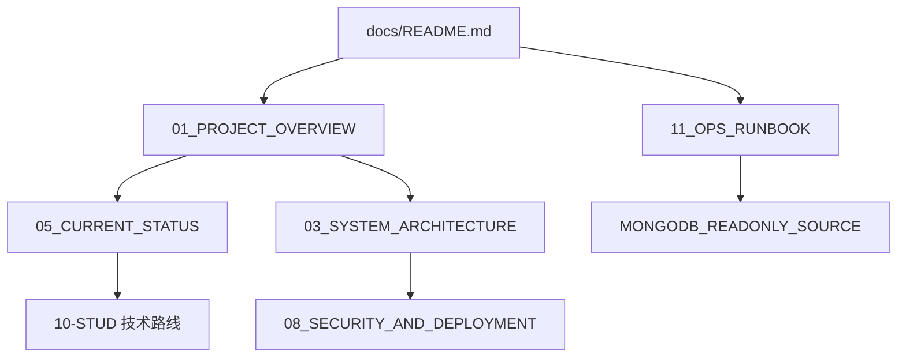
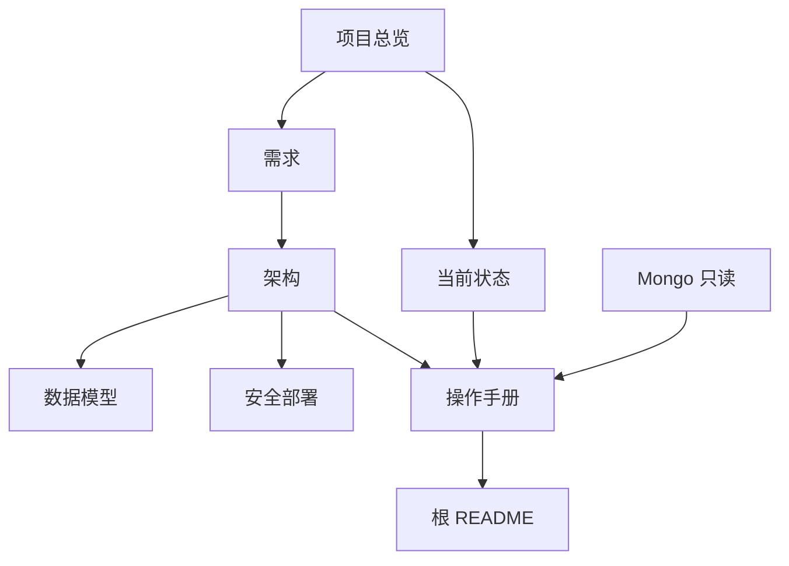

# 文档关系与项目文件说明

> 以当前仓库为准（2026-08）。历史交付包路径若不同，以本仓库 `docs/` 为准。

## 1. 推荐阅读顺序

根目录 [`README.md`](../README.md) 是日常入口；技术细节从 `docs/README.md` 展开。

## 2. 文档职责

| 文件 | 作用 |
|------|------|
| `docs/README.md` | 文档索引与信任标记 |
| `01_PROJECT_OVERVIEW.md` | 为什么做、业务问题、产品形态 |
| `02_REQUIREMENTS_SPEC.md` | 页面和业务需求 |
| `03_SYSTEM_ARCHITECTURE.md` | 技术架构和模块（含软刷新策略） |
| `04_DATA_MODEL_AND_METRICS.md` | 表结构、指标键 |
| `05_CURRENT_STATUS_AND_DELIVERABLES.md` | 已交付与已知限制 |
| `06_PHASE_ROADMAP.md` | 阶段路线 |
| `07_ACCEPTANCE_CRITERIA.md` | 验收标准 |
| `08_SECURITY_AND_DEPLOYMENT.md` | 安全边界与 Docker |
| `09_RISKS_AND_OPEN_QUESTIONS.md` | 风险与开放问题 |
| `10_DOCUMENT_RELATIONSHIP_MAP.md` | 本文件 |
| `11_OPS_RUNBOOK.md` | **操作执行**：启动、同步、卡死恢复、Docker |
| `MONGODB_READONLY_SOURCE.md` | Mongo 只读联调 |
| `CT_SIID_PIID_REPORTING.md` | SIID/PIID 上报对照 |
| `10-STUD-学习/01-STUD-技术路线总览.md` | 实现原理复盘 |

## 3. 运维相关脚本（非 docs，但与 OPS 配套）

| 路径 | 作用 |
|------|------|
| `start-monitor.ps1` | 一键：迁移 → SN 映射 → sync → worker → Next |
| `scripts/open-monitor.ps1` | 起 Next；端口在听但不健康则杀进程重启 |
| `Dockerfile` / `docker-compose.yml` | 正式 Web + Sync profile |
| `.env.local.example` / `.env.docker.example` | 环境变量模板 |

## 4. 依赖关系（核心）

