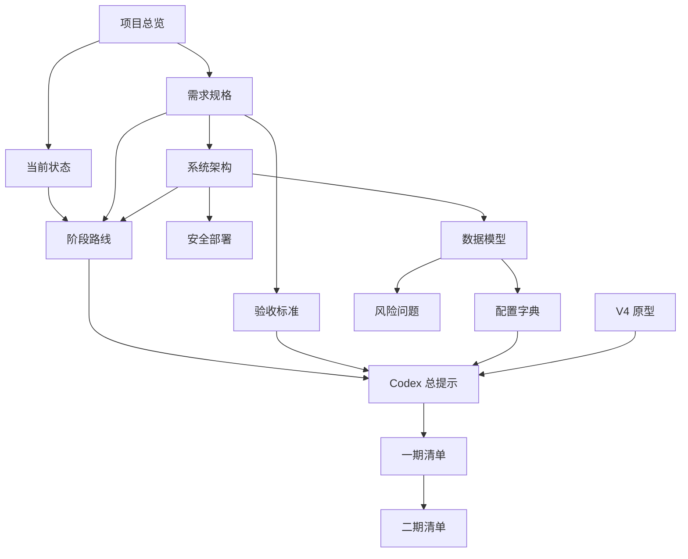

# 文档关系与项目文件说明

## 1. 目录关系

```text
anti_reverse_device_monitor_delivery_v1/
├── 00_START_HERE.md
│
├── docs/
│   ├── 01_PROJECT_OVERVIEW.md
│   ├── 02_REQUIREMENTS_SPEC.md
│   ├── 03_SYSTEM_ARCHITECTURE.md
│   ├── 04_DATA_MODEL_AND_METRICS.md
│   ├── 05_CURRENT_STATUS_AND_DELIVERABLES.md
│   ├── 06_PHASE_ROADMAP.md
│   ├── 07_ACCEPTANCE_CRITERIA.md
│   ├── 08_SECURITY_AND_DEPLOYMENT.md
│   ├── 09_RISKS_AND_OPEN_QUESTIONS.md
│   └── 10_DOCUMENT_RELATIONSHIP_MAP.md
│
├── codex/
│   ├── CODEX_MASTER_PROMPT.md
│   ├── PHASE1_EXECUTION_CHECKLIST.md
│   ├── PHASE2_EXECUTION_CHECKLIST.md
│   └── GIT_AND_DELIVERY_RULES.md
│
├── config/
│   ├── .env.local.example
│   ├── metric_dictionary.example.json
│   ├── status_dictionary.json
│   └── fault_dictionary.json
│
├── references/
│   ├── PROPERTY_MODEL_REFERENCE.md
│   ├── FAULT_FLAG_TYPE.h
│   └── SOURCE_DATA_NOTES.md
│
├── prototype/
│   └── v4/
│       ├── index.html
│       ├── device-GC2001000000252.html
│       ├── inverter-GC2001000000252-1.html
│       ├── ...
│       └── inverter-GC2001000000252-8.html
│
├── DELIVERY_MANIFEST.json
└── README.md
```

## 2. 文档职责

| 文件 | 作用 | 依赖 |
|---|---|---|
| `00_START_HERE.md` | 入口和阅读顺序 | 全部 |
| `01_PROJECT_OVERVIEW.md` | 为什么做、做什么、可复用思想 | 无 |
| `02_REQUIREMENTS_SPEC.md` | 页面和业务需求 | 项目总览 |
| `03_SYSTEM_ARCHITECTURE.md` | 技术架构和模块 | 需求 |
| `04_DATA_MODEL_AND_METRICS.md` | 表结构、指标键和规则 | 架构、需求 |
| `CT_SIID_PIID_REPORTING.md` | 固件 siid/piid、是否上报、如何查看 | 数据模型、Mongo 只读源 |
| `MONGODB_READONLY_SOURCE.md` | Mongo 只读同步与联调 | 架构、安全 |
| `05_CURRENT_STATUS_AND_DELIVERABLES.md` | 已完成与未完成 | 原型 |
| `06_PHASE_ROADMAP.md` | 一期、二期和后续计划 | 架构、状态 |
| `07_ACCEPTANCE_CRITERIA.md` | 如何判断完成 | 需求、路线 |
| `08_SECURITY_AND_DEPLOYMENT.md` | 数据库、安全、部署 | 架构 |
| `09_RISKS_AND_OPEN_QUESTIONS.md` | 未确认信息和风险 | 数据模型 |
| `CODEX_MASTER_PROMPT.md` | Codex 总执行规范 | 所有核心文档 |
| `PHASE1_EXECUTION_CHECKLIST.md` | 一期可执行任务 | 总提示、验收 |
| `PHASE2_EXECUTION_CHECKLIST.md` | 二期数据库接入任务 | 一期完成 |
| `GIT_AND_DELIVERY_RULES.md` | Git 和交付纪律 | Codex 工作 |
| `prototype/v4` | 视觉和交互参考 | 当前样例数据 |
| `config/*.json` | 领域规则配置 | 数据模型 |
| `.env.local.example` | 环境变量模板 | 架构、安全 |

## 3. 依赖关系



## 4. Codex 使用方式

Codex 不应只读取 `CODEX_MASTER_PROMPT.md` 就开始写代码。

必须先读取：

```text
项目总览
→ 需求
→ 架构
→ 数据模型
→ 当前状态
→ 阶段计划
→ 验收
→ 安全
→ 风险
→ 原型
→ Codex 执行提示
```

## 5. 原型的定位

`prototype/v4` 是：

- 页面信息结构参考；
- 交互参考；
- 样例数据展示参考；
- 故障和状态解释参考。

它不是：

- 正式代码架构；
- 正式数据库；
- 生产部署；
- 实时系统；
- 安全认证系统。
