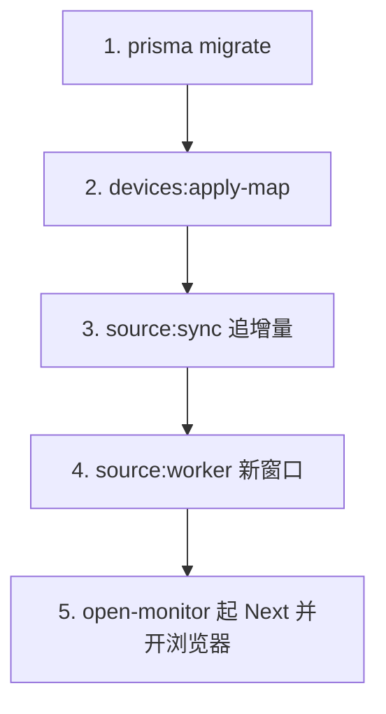

# 本地与 Docker 操作手册

> 证据级别：本地启动 / 同步 / 软刷新策略 ✅ 已对照代码与联调；Docker Compose 打包 ✅ 仓库内已有，本机未装 Docker 故 ⚠️ 待环境验证。

## 1. 推荐日常启动（Windows）

一键脚本：`start-monitor.ps1`（仓库根目录）。



步骤说明：

| 步骤 | 动作 | 说明 |
|------|------|------|
| 1/5 | `scripts/ensure-db-migrations.mjs` | 应用本地 SQLite 迁移 |
| 2/5 | `npm run devices:apply-map` | `config/device-sn-map.xlsx` → `config/devices.json` |
| 3/5 | `npm run source:sync` | 按 checkpoint 从 Mongo 追到「现在」 |
| 4/5 | `npm run source:worker` | 后台增量（默认约 60s，看 `.env.local`） |
| 5/5 | `scripts/open-monitor.ps1` | 健康检查 `:3000`，不健康则杀旧 Next 再起 |

前置：

- 已有 `.env.local`（自 `.env.local.example` 复制并填 Mongo）
- 已有 `config/device-sn-map.xlsx`
- 已安装 Node.js

浏览器入口：`http://localhost:3000/devices`

## 2. 手动命令（等价拆分）

```bash
# 开发 Web
npm run dev

# 一次性增量同步（隔夜后可能很久）
npm run source:sync

# 常驻增量 Worker（勿与第二份 Worker 重复开）
npm run source:worker

# 单设备重同步（忽略共享 checkpoint）
npm run source:sync -- --device-id <mongo_device_id>
```

## 3. 隔夜 / 关机后再开为什么很慢？

`source:sync` 使用 **checkpoint 高水位 → 当前时刻** 窗口。电脑与 Worker 停了一夜后，窗口可达十余小时，Mongo 分页约每页 18s（代理链路），总时长十几分钟属正常。

白天 Worker 一直跑时，窗口只有一两分钟，通常 1～2 页就结束，所以会感觉「以前很快」。

建议：日常尽量保持 `source:worker` 窗口不关；追数未完成前不要依赖页面「实时最新」。

## 4. 页面转圈 / Next 假死

### 根因（已定位）

设备详情页一次 RSC 极重（历史 + 8 路微逆摘要 + 8 路 7 天曲线）。旧版 `LiveSourcePoller` 约每 45s **无条件** `router.refresh()`，并在 pending 超时后**再叠一次刷新**，会把 Next 打到 `CLOSE_WAIT` / 高 CPU / 全站超时。

### 当前策略（代码）

| 规则 | 位置 |
|------|------|
| 总览：指纹变化才 soft-refresh | `soft-refresh-policy.ts`、`LiveSourcePoller` |
| 详情/微逆：指纹变 →「有新数据」横幅；**≥5 分钟**且无 pending 才自动整页刷一次 | 同上 + `DataStaleBanner` |
| KPI 带约 60s 拉 `/api/devices/[sn]/latest` 局部更新 | `device-live-kpis.tsx` |
| pending 时禁止再开第二次刷新 | 同上 |
| Prisma SQLite 补 `socket_timeout` + `connection_limit=1` | `src/lib/sqlite-url.ts`、`src/lib/prisma.ts` |
| open-monitor：端口在听但不健康则杀进程重启 | `scripts/open-monitor.ps1` |

新鲜度预期（非秒级）：Worker 默认约 10s 起一轮 → KPI 约 1～2 分钟跟上；曲线点「刷新数据」立刻，或最多约 5 分钟自动整页一次。

详情页要立刻更新曲线：点右上角 **「刷新数据」** 或横幅上的 **「刷新完整页面」**。

### 应急恢复

1. 结束占用 3000 的 `next` / `start-server` 进程  
2. `npm run dev` 或再跑 `start-monitor.ps1` 的第 5 步  
3. 硬刷新浏览器（勿死等旧标签）

## 5. 总览筛选能力（运维观察）

| 筛选 / 卡片 | 含义 |
|-------------|------|
| 正在逆流 | 在线 CT 当前三相功率为负 |
| 近7天长时逆流 | 近 7 天任一相逆流区间持续 **≥40 分钟** |
| 待处理离线 | CT 离线不足 7 天 |
| 存在离线微逆 | 已配对通道中有 offline（`online_state≠2`） |
| 在线 / 活跃 CT | 在线数 / 活跃总数 |

相关实现：`DeviceService.listDevices`、`src/domain/sustained-reverse-flow.ts`。

## 6. Docker 部署（正式）

⚠️ 需已安装 Docker Desktop / Compose。

```bash
copy .env.docker.example .env.docker
# 编辑 .env.docker：MONGODB_URI 等；SOURCE_DB_ENABLED=true
# 确认 config/devices.json（构建时打进镜像）

docker compose up --build -d
# 常驻同步 Worker（与 Web 共享 app-data 卷）
docker compose --profile sync up -d sync
```

说明：

- `app`：Next 生产服务，`ENTRYPOINT` 先 `prisma migrate deploy`
- `sync`：`npm run source:worker`
- 数据卷：`app-data` → `/app/data`
- 密钥只在 `.env.docker`，勿提交；镜像内不嵌密码

一次性同步（调试）：

```bash
docker compose --profile sync run --rm sync
# 或
docker compose exec app npm run source:sync
```

更多见 [MONGODB_READONLY_SOURCE.md](./MONGODB_READONLY_SOURCE.md)。

## 7. 验证命令

```bash
npm run typecheck
npm test
npm run build
npm run verify-data
```
